# 당뇨 예측 모델 보고서

<p align="right">작성자: 김택권      </p>

## 1. 한 줄 요약

- 우리 팀은 건강검진 데이터로 “당뇨 위험”을 예측하는 AI 모델을 만들었습니다.
- 기존 핵심 피처(`sex(성별)`, `age(나이)`, `HE_BMI(BMI)`, `HE_wc(허리둘레)`, `HE_glu(공복 혈당)`)만으로도 실사용 가능한 성능을 확인했습니다.
- 추가 선택형 피처(F1~F2)는 별도 시뮬레이션 검증 후 앱/서버에 조건부 반영했으며, 성능 지표(Recall/FN/FP)는 지속 모니터링합니다.

---

## 2. 우리가 푼 문제

| 질문 | 답 |
|---|---|
| 무엇을 예측? | 당뇨인지 아닌지(2가지 분류) |
| 데이터는? | KNHANES 2019 (`HN19_ALL.sav`) |
| 대상 나이 | 만 19세 이상 |
| 정답 라벨 | `HE_DM_HbA1c(당뇨병 유병여부)` 값으로 당뇨/비당뇨 구분 |

### 데이터 원본 출처

| 항목 | 내용 |
|---|---|
| 데이터명 | 국민건강영양조사(KNHANES) 제8기(2019-2021) 원시자료 중 2019 데이터 |
| 원본 파일 | `HN19_ALL.sav` |
| 출처 기관 | 질병관리청(KDCA) 국민건강영양조사 |
| 프로젝트 내 보관 경로 | `fastapi/resources/data/HN19_ALL.sav` |
| 참고 문서 | `국민건강영양조사+제8기(2019-2021)+원시자료+이용지침서.pdf` |

### 왜 이 데이터를 사용했나?

| 이유 | 설명 |
|---|---|
| 신뢰도 높은 국가 데이터 | 국가 단위 건강조사 데이터라 품질/신뢰도가 높음 |
| 당뇨 관련 변수 포함 | 나이, BMI, 허리둘레, 혈당 등 핵심 변수가 포함됨 |
| 한국인 대상 예측에 적합 | 한국인 표본 기반이라 국내 사용자 앱에 더 적합 |
| 문서화된 변수 체계 | 이용지침서가 있어 변수 해석과 재현이 용이함 |

### 정답(타겟) 만들기

| 원래 값 | 바꾼 값 |
|---|---|
| 1, 2 | 0 (비당뇨) |
| 3 | 1 (당뇨) |

---

## 3. 어떤 입력값(피처)을 썼나?

### 3-1. 기본 입력

| 컬럼(한글) | 설명 | 앱에서 받는 값 |
|---|---|---|
| `sex(성별)` | 성별 | 성별 |
| `age(나이)` | 나이 | 나이 |
| `HE_BMI(BMI)` | 비만도(BMI) | BMI |
| `HE_wc(허리둘레)` | 복부 비만 지표 | 허리둘레 |
| `HE_glu(공복 혈당)` | 공복 혈당 | 혈당(선택) |

### 3-2. 추가로 만든 값(파생 피처)

| 컬럼(한글) | 만드는 방법 | 왜 만들었나? |
|---|---|---|
| `HE_whr(허리-신장 비율)` | `HE_wc(허리둘레)` / `HE_ht(키)` | 체형 특징을 더 잘 반영 |
| `HE_bmi_wc(BMI×허리 보정)` | `HE_BMI(BMI)` × (`HE_wc(허리둘레)` / 100) | 단일 지표보다 복합 정보 반영 |

### 3-3. 두 가지 실험

| 실험 | 포함 피처 수 | 특징 |
|---|---:|---|
| 혈당 포함 | 7개 | `HE_glu(공복 혈당)` 포함 |
| 혈당 미포함 | 6개 | `HE_glu(공복 혈당)` 없이 예측 |

### 3-4. 원본(`HN19_ALL.sav`) 대비 단계별 데이터 규모

| 단계 | 조건 | 행 수(n) | 잔존율(원본 대비) |
|---|---|---:|---:|
| 원본 | 전체 레코드 | 8,110 | 100.0% |
| 1차 필터 | `age(나이) >= 19` | 6,606 | 81.5% |
| 2차 필터 | `HE_DM_HbA1c(당뇨 유병)` ∈ {1,2,3} | 5,914 | 72.9% |
| 3차 필터 | 기본 피처 유효 (`HE_BMI(BMI)`, `HE_wc(허리둘레)`, `HE_ht(키)` > 0) | 5,874 | 72.4% |

### 3-5. 모델 입력 데이터프레임 info (핵심/확장 변수 결측 현황)

> 기준 데이터프레임: 3차 필터 후 `n=5,874`

| 변수 | non-null | 결측률 |
|---|---:|---:|
| `sex(성별)` | 5,874 | 0.00% |
| `age(나이)` | 5,874 | 0.00% |
| `HE_BMI(BMI)` | 5,874 | 0.00% |
| `HE_wc(허리둘레)` | 5,874 | 0.00% |
| `HE_ht(키)` | 5,874 | 0.00% |
| `HE_glu(공복 혈당)` | 5,874 | 0.00% |
| `F1_family_dm(가족력)` | 5,292 | 9.91% |
| `F2_htn_or_med(고혈압/혈압약)` | 5,864 | 0.17% |

> 참고: `HE_glu(공복 혈당)`는 데이터셋 전체에는 고값(outlier)이 일부 존재하며, 앱 API에서는 입력 범위(44~199)를 사용합니다.  
> 기본 유효 표본 5,874건 중 앱 입력 범위(44~199)에 해당하는 건수는 5,813건입니다.

### 3-6. 핵심 연속형 변수 describe (기본 유효 표본, n=5,874)

| 변수 | mean | std | min | 25% | 50%(median) | 75% | max |
|---|---:|---:|---:|---:|---:|---:|---:|
| `age(나이)` | 51.57 | 16.78 | 19.0 | 38.0 | 52.0 | 65.0 | 80.0 |
| `HE_BMI(BMI)` | 23.92 | 3.59 | 13.98 | 21.47 | 23.60 | 25.99 | 50.29 |
| `HE_wc(허리둘레)` | 83.97 | 10.41 | 53.0 | 76.6 | 83.8 | 90.8 | 135.9 |
| `HE_ht(키)` | 163.69 | 9.36 | 133.3 | 156.7 | 163.3 | 170.5 | 194.0 |
| `HE_glu(공복 혈당)` | 101.23 | 22.42 | 53.0 | 90.0 | 96.0 | 105.0 | 339.0 |

### 3-7. 기본 피처와 확장 후보 피처 비교 (사전 검증/조건부 반영 관점)

| 구분 | 변수(한글) | 초기 모델(기본 피처) | 확장 후보 검증 | 데이터 품질/관찰 |
|---|---|---|---|---|
| 핵심(기본) | `sex(성별)`, `age(나이)`, `HE_BMI(BMI)`, `HE_wc(허리둘레)`, `HE_glu(공복 혈당)` | 사용 | 기준 피처로 유지 | 결측 낮고 안정적 |
| 확장 F1 | `HE_DMfh1/2/3(가족 당뇨 진단력)` | 조건부 사용(혈당 미입력 경로) | 사전 검증 + 조건부 반영 완료 | 결측 약 9.9%, no_glu 경로에서 보조 피처 가치 확인 |
| 확장 F2 | `DI1_dg`, `HE_HPdr`, `HE_HP`(고혈압/혈압약) | 조건부 사용(우선 반영) | 사전 검증 + 조건부 반영 완료 | 결측 매우 낮음, binned/exact 경로에서 개선 우세 |

### 3-8. 데이터 현황 시각화 차트

- 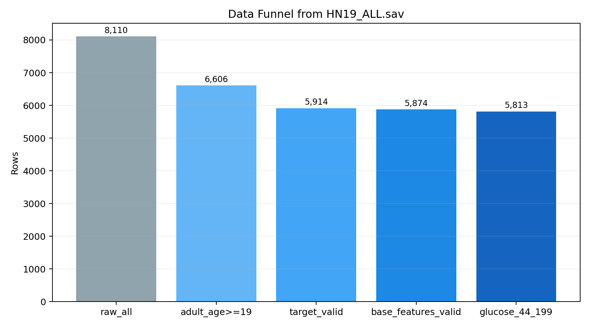
- 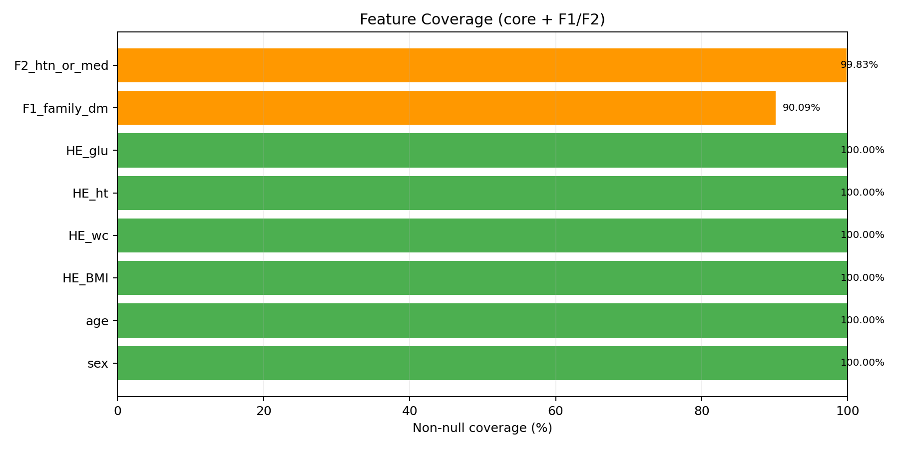
- 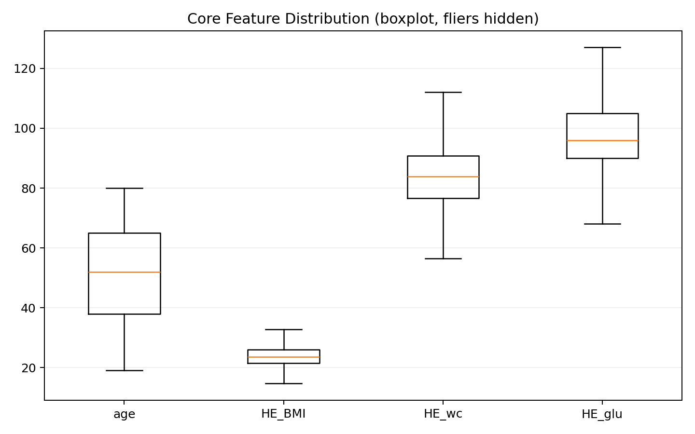

| 차트 | 핵심 메시지 |
|---|---|
| Data Funnel | 원본 8,110행에서 모델 유효 표본 5,874행으로 수렴하는 과정을 확인 |
| Feature Coverage | 핵심 변수와 F1/F2의 커버리지 분포를 확인 |
| Core Feature Boxplot | `age(나이)`, `HE_BMI(BMI)`, `HE_wc(허리둘레)`, `HE_glu(공복 혈당)` 분포 범위를 직관적으로 확인 |

---

## 4. 데이터 전처리(데이터 정리) 과정

“전처리”는 모델이 잘 배우도록 데이터를 정리하는 과정입니다.

| 순서 | 한 일 | 설명 |
|---|---|---|
| 1 | 성인만 남김 | 19세 이상만 사용 |
| 2 | 라벨 변환 | 당뇨/비당뇨 2가지로 단순화 |
| 3 | 결측 처리 | 빈칸(결측값)을 보완 |
| 4 | 표준화 | 값 크기를 비슷한 기준으로 맞춤 |
| 5 | 파생 피처 추가 | 허리-키 비율 등 새 정보 생성 |
| 6 | SMOTE | 당뇨 데이터가 적을 때 균형 보정 |

### 표준화 vs 정규화, 왜 표준화를 선택했나?

| 방법 | 의미 | 이번 선택 |
|---|---|---|
| 정규화 | 값을 0~1 범위로 맞춤 | 미선택 |
| 표준화 | 평균 0, 표준편차 1로 맞춤 | **선택** |

선택 이유: 이번에 쓴 KNN 같은 모델은 거리 계산을 많이 쓰기 때문에, 표준화가 안정적이었습니다.

---

## 5. Train / Validation / Test 나누기

| 데이터 묶음 | 비율 | 역할 |
|---|---:|---|
| Train | 70% | 모델 학습 |
| Validation | 10% | 기준점(임계값) 조정 |
| Test | 20% | 최종 성능 평가 |

쉽게 말해,
- **Train**: 공부용
- **Validation**: 모의고사
- **Test**: 최종 시험

---

## 6. 어떤 모델을 비교했고, 왜 이 모델을 골랐나?

### 6-1. 비교한 모델

| 분류 | 모델 |
|---|---|
| 선형 | LogisticRegression, SGDClassifier |
| 트리/앙상블 | RandomForest, GradientBoosting, AdaBoost |
| 거리/마진 | KNN, SVM |
| 신경망 | MLPClassifier |

### 6-2. 최종 선택 결과

두 실험 모두 **KNN**이 가장 좋은 점수를 얻었습니다.

| 실험 | 최종 모델 | 핵심 하이퍼파라미터 |
|---|---|---|
| 혈당 포함 | KNN | `n_neighbors=3`, `weights=distance`, `p=2` |
| 혈당 미포함 | KNN | `n_neighbors=3`, `weights=distance`, `p=2` |

### 6-3. 하이퍼파라미터(세부 설정) 선택 과정

- 여러 값 조합을 자동으로 시험해보는 방식(Grid Search)으로 비교
- 점수 기준: `balanced_recall`  
  (정확도 + 환자 잘 찾는 능력(Recall)을 같이 반영)

---

## 7. 성능 결과 (숫자)

### 7-1. 핵심 지표 비교

| 지표 | 혈당 포함(기본+`HE_glu`) | 혈당 미포함(기본만) |
|---|---:|---:|
| Accuracy | 0.8368 | 0.6675 |
| Precision | 0.4516 | 0.2267 |
| Recall | 0.8284 | 0.6036 |
| F1 | 0.5846 | 0.3296 |
| ROC-AUC | 0.8608 | 0.6565 |

### 7-2. 왜 Accuracy만 보면 안 되나?

의료 문제에서는 “진짜 환자를 놓치지 않는 것”이 중요합니다.  
그래서 **Recall**을 특히 중요하게 봤습니다.

| 지표 | 의미 | 왜 중요한가 |
|---|---|---|
| Accuracy | 전체 정답 비율 | 참고용 |
| Precision | 당뇨라고 한 것 중 진짜 비율 | 경고 정확도 |
| Recall | 실제 당뇨를 얼마나 잘 찾는지 | 의료에서 매우 중요 |
| F1 | Precision/Recall 균형 | 종합 판단 |

---

## 8. Confusion Matrix(예측 결과 요약표)

| 실험 | TN | FP | FN | TP |
|---|---:|---:|---:|---:|
| 혈당 포함 | 880 | 170 | 29 | 140 |
| 혈당 미포함 | 731 | 348 | 67 | 102 |

해석:
- **FN(놓친 환자)**가 적을수록 의료에 유리합니다.
- 혈당 포함 모델이 FN이 더 적어서 더 안전한 편입니다.

---

## 9. 어떤 모델이 의료 문제에 더 맞나?

결론: **혈당 포함 KNN 모델**이 더 적합합니다.

이유:
1. Recall이 더 높음 (환자를 더 잘 찾음)
2. ROC-AUC가 더 높음 (전체 구분 능력이 좋음)
3. Confusion Matrix에서 FN이 더 적음 (놓치는 환자 감소)

---

## 10. 앱 구현 시 전체 컬럼이 다 필요한가?

결론: **아니요. 핵심 입력만 필요합니다.**

| 구분 | 항목(변수) | 설명 |
|---|---|---|
| 앱에서 직접 입력 | 성별(`sex`), 나이(`age`), 키(`height_cm`), 몸무게(→`HE_BMI` 계산), 허리둘레(`HE_wc`) | 사용자가 화면에서 직접 입력 |
| 앱에서 선택 입력 | 혈당(`HE_glu`) | 입력하면 혈당 포함 모델 사용 |
| 앱 내부 계산 | BMI(`HE_BMI`) | 키/몸무게로 앱에서 계산 후 서버 전송 |
| 서버 내부 계산 | `HE_whr(허리-신장 비율)` | `HE_wc(허리둘레)` / `HE_ht(키)` |
| 서버 내부 계산 | `HE_bmi_wc(BMI×허리 보정)` | `HE_BMI(BMI)` × (`HE_wc(허리둘레)`/100) |

> 운영 입력 정책: `HE_wc(허리둘레)`는 본 앱에서 **필수 입력**으로 유지합니다.

---

## 11. 그림으로 보는 결과 (이미지 중심)

### Figure 1. 테스트 지표 비교
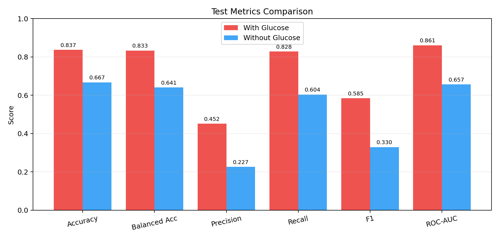

- 이 차트는 두 시나리오(혈당 포함/미포함)의 핵심 성능 지표를 한 번에 비교합니다.
- X축: 지표 종류(Accuracy, Precision, Recall, F1, ROC-AUC)
- Y축: 점수(0~1)
- 해석 포인트: 막대가 **높을수록 성능이 좋음**. 대부분 지표에서 혈당 포함 막대가 더 높습니다.

### Figure 2. CV 점수 및 임계값 비교
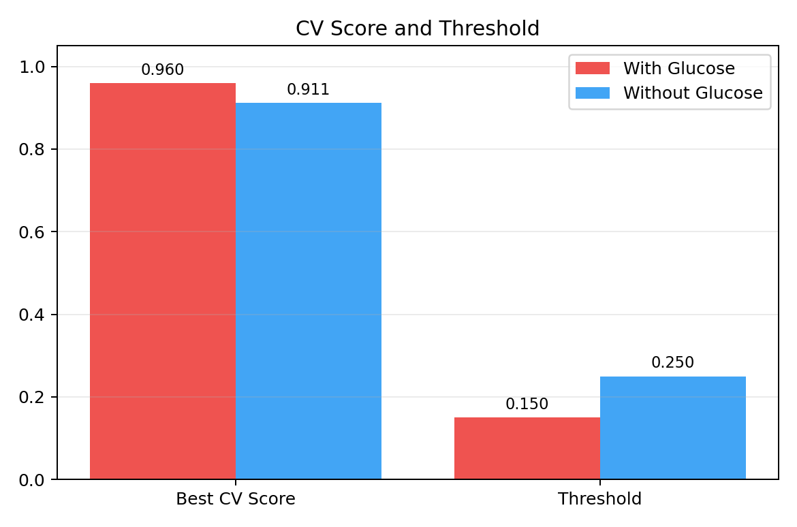

- 이 차트는 모델 선택에 사용된 교차검증 점수와 최종 임계값(threshold)을 비교합니다.
- X축: `Best CV Score`, `Threshold`
- Y축: 값(0~1)
- 해석 포인트: CV 점수는 **높을수록 좋고**, Threshold는 분류 경계값으로 높고 낮음 자체보다 운영 목적(민감도/정밀도)에 따라 의미가 달라집니다.

### Figure 3. 레이더 차트(종합 성능)
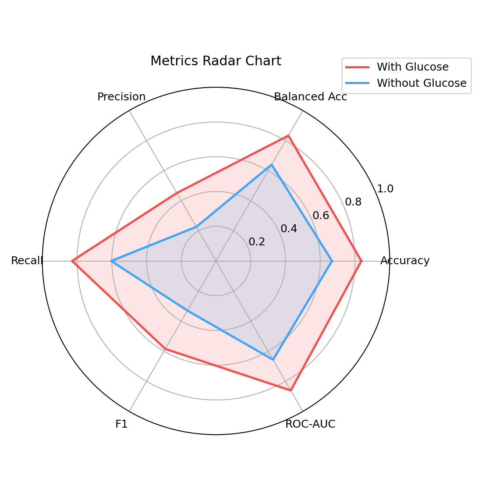

- 이 차트는 여러 지표를 원형으로 동시에 보여주는 종합 비교 그래프입니다.
- 각 축(방사형 축): Accuracy, Balanced Accuracy, Precision, Recall, F1, ROC-AUC
- 중심에서 바깥쪽으로 갈수록 점수가 큼(0→1)
- 해석 포인트: 면적이 넓고 바깥쪽일수록 전반 성능이 좋습니다. 혈당 포함 모델의 면적이 더 큽니다.

### Figure 4. Confusion Matrix 비교
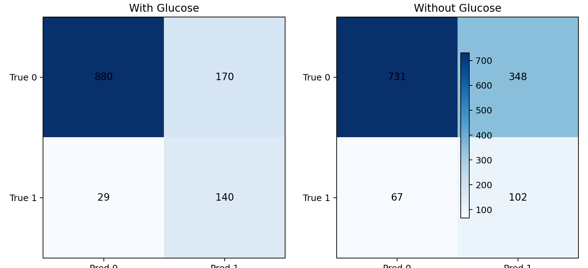

- 이 차트는 정답/오답을 2x2 표로 보여줍니다.
- X축: 모델 예측값(Pred 0, Pred 1), Y축: 실제값(True 0, True 1)
- 셀 의미: TN(정상 맞춤), FP(정상을 당뇨로 예측), FN(당뇨를 정상으로 놓침), TP(당뇨 맞춤)
- 해석 포인트: 의료 관점에서는 **FN이 낮을수록 유리**합니다. 혈당 포함 모델의 FN이 더 낮습니다.

### Figure 5. ROC Curve 비교
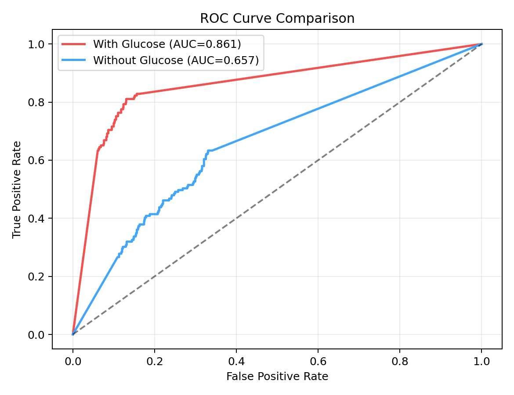

- 이 차트는 임계값을 바꿀 때 모델의 구분 능력이 어떻게 변하는지 보여줍니다.
- X축: FPR(False Positive Rate, 거짓 양성 비율)
- Y축: TPR(True Positive Rate, 실제 양성 탐지율 = Recall)
- 해석 포인트: 곡선이 **왼쪽 위에 가까울수록 좋고**, AUC 값이 **높을수록 좋습니다**.

### Figure 6. 피처 수 비교
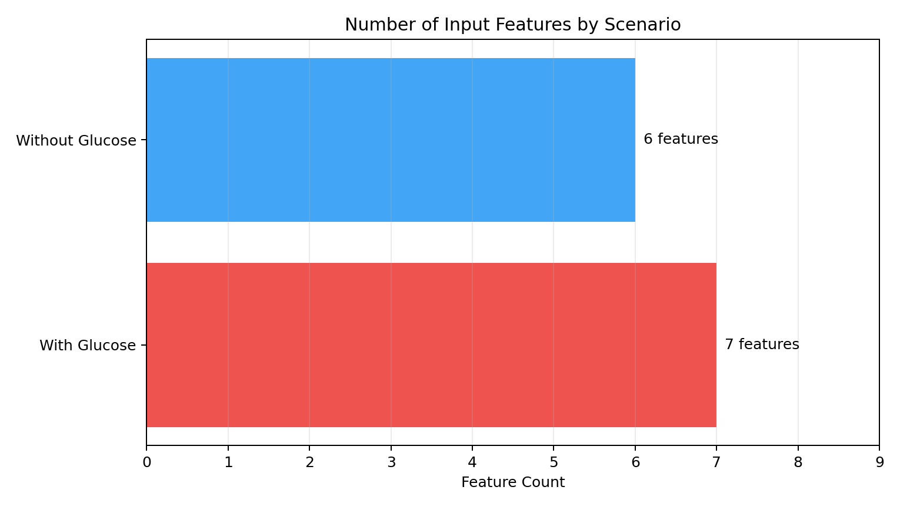

- 이 차트는 시나리오별 입력 피처 개수를 비교합니다.
- X축: 피처 개수
- Y축: 시나리오(혈당 포함/미포함)
- 해석 포인트: 혈당 포함 시나리오가 피처 1개(`HE_glu`) 더 많습니다.

### Figure 7. Precision/Recall/F1 비교
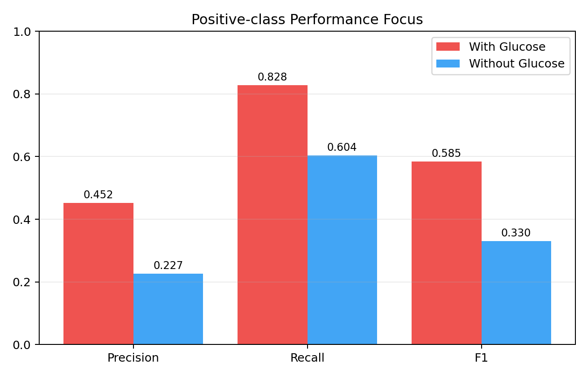

- 이 차트는 양성 클래스(당뇨) 중심 지표만 따로 비교합니다.
- X축: Precision, Recall, F1
- Y축: 점수(0~1)
- 해석 포인트: 막대가 **높을수록 좋음**. 특히 Recall 차이를 통해 환자 탐지 능력 차이를 확인할 수 있습니다.

### Figure 8. 오류 유형(FP/FN) 비교
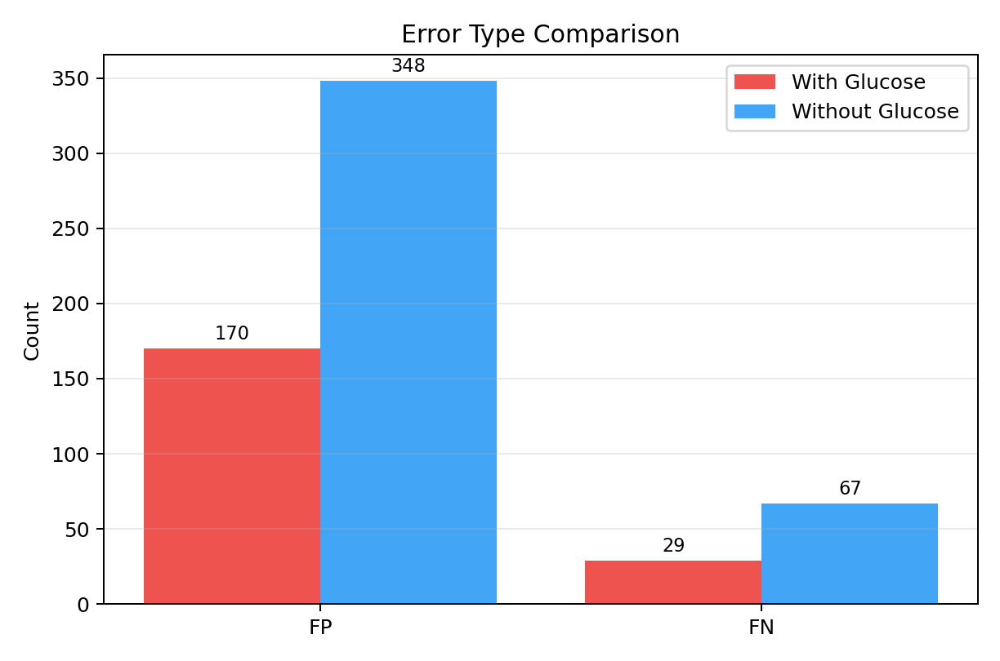

- 이 차트는 모델이 만든 두 가지 핵심 오류(FP, FN) 개수를 비교합니다.
- X축: 오류 유형(FP, FN)
- Y축: 오류 개수(건수)
- 해석 포인트: 의료 선별에서는 FN(환자 놓침)을 줄이는 것이 중요합니다. **막대가 낮을수록 더 바람직**합니다.

---

## 12. 재현(다시 실행) 방법

```bash
cd fastapi
source .venv/bin/activate

# 혈당 포함 모델 학습
python train_knhanes.py --with-glucose --feature-eng --poly --smote --score-by balanced_recall --save

# 혈당 미포함 모델 학습
python train_knhanes.py --feature-eng --poly --smote --score-by balanced_recall --save
```

데이터 파일 위치:
- `fastapi/resources/data/HN19_ALL.sav`

---

## 13. 운영 시나리오 시뮬레이션 (현재 앱 로직)

### 13-1. 용어 정리

| 용어 | 정의 |
|---|---|
| `glu_exact` | `HE_glu(공복 혈당)`을 연속값(정밀값)으로 입력한 경우 |
| `glu_binned` | 혈당 구간값(midpoint)으로 입력한 경우 |
| `no_glu` | `HE_glu(공복 혈당)` 미입력 |
| `blend` | 혈당 의존도 완화를 위한 확률 혼합: `0.55 * no_glu + 0.45 * glu` |

### 13-2. 시뮬레이션 결과 표 (`resources/simulation/simulation_summary.csv`)

| 시나리오 | Accuracy | Precision | Recall | F1 | ROC-AUC | FP | FN |
|---|---:|---:|---:|---:|---:|---:|---:|
| glu_exact | 0.9475 | 0.7526 | 0.9108 | 0.8242 | 0.9444 | 47 | 14 |
| glu_binned | 0.8590 | 0.4877 | 0.8854 | 0.6290 | 0.9116 | 146 | 18 |
| no_glu | 0.9020 | 0.5923 | 0.8790 | 0.7077 | 0.9156 | 95 | 19 |
| blend_exact | 0.8942 | 0.5620 | 0.9809 | 0.7146 | 0.9840 | 120 | 3 |
| blend_binned | 0.8564 | 0.4843 | 0.9809 | 0.6484 | 0.9783 | 164 | 3 |

### 13-3. 해석 요약

| 관점 | 해석 |
|---|---|
| 최고 종합 성능 | `glu_exact`가 Accuracy/F1에서 가장 우수 |
| 혈당 구간 입력 | `glu_binned`는 정밀 입력 대비 정보 손실 존재 |
| FN 최소화 운영 | `blend`는 FN 감소에 유리하지만 FP 증가 트레이드오프 존재 |

### 13-4. 차트

- 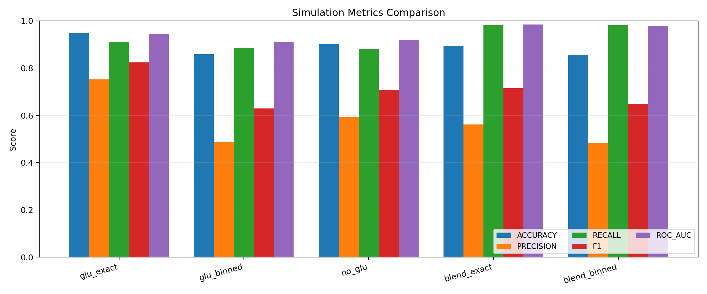
- 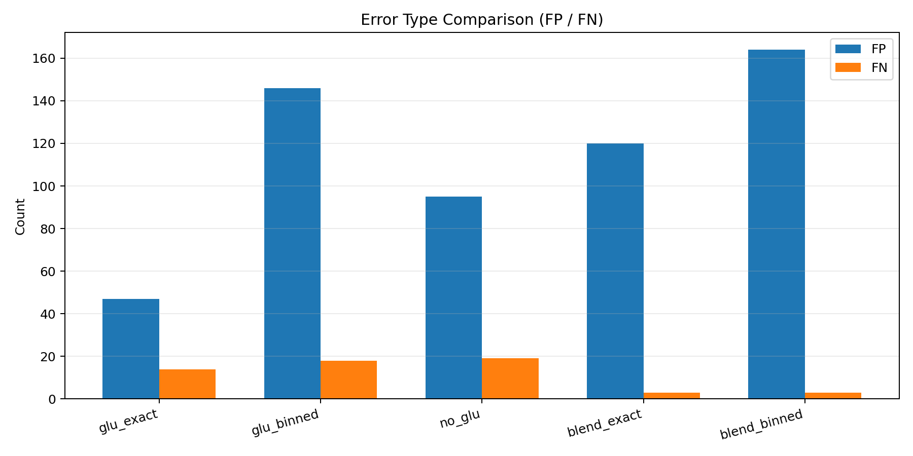

---

## 14. F1~F2 사전 검증 결과 (추가 피처 플랜)

### 14-1. 플랜 피처 매핑 표

| 플랜 피처 | 데이터 변수(한글) | 반영 상태 |
|---|---|---|
| F1 가족력 | `HE_DMfh1(부 당뇨 진단력)`, `HE_DMfh2(모 당뇨 진단력)`, `HE_DMfh3(형제자매 당뇨 진단력)` | 시뮬레이션 매핑 완료 |
| F2 고혈압/혈압약 | `DI1_dg(고혈압 의사진단)`, `HE_HPdr(검진당일 혈압약 복용)`, `HE_HP(고혈압 유병)` | 시뮬레이션 매핑 완료 |

### 14-2. F1/F2 분리(Ablation) 포함 결과 표 (`resources/simulation/feature_plan_simulation_summary.csv`)

| 시나리오 | optional mode | glucose mode | Accuracy | Precision | Recall | F1 | ROC-AUC | FP | FN |
|---|---|---|---:|---:|---:|---:|---:|---:|---:|
| base_no_glu | none | none | 0.7219 | 0.2830 | 0.6095 | 0.3865 | 0.6974 | 261 | 66 |
| opt1_no_glu | f1 | none | 0.7287 | 0.2984 | 0.6568 | 0.4104 | 0.7211 | 261 | 58 |
| opt2_no_glu | f2 | none | 0.7134 | 0.2801 | 0.6331 | 0.3884 | 0.6955 | 275 | 62 |
| opt12_no_glu | f12 | none | 0.7245 | 0.2817 | 0.5917 | 0.3817 | 0.6852 | 255 | 69 |
| base_glu_binned | none | binned | 0.8673 | 0.5243 | 0.8284 | 0.6422 | 0.8892 | 127 | 29 |
| opt1_glu_binned | f1 | binned | 0.8690 | 0.5283 | 0.8284 | 0.6452 | 0.8875 | 125 | 29 |
| opt2_glu_binned | f2 | binned | 0.8741 | 0.5399 | 0.8402 | 0.6574 | 0.8901 | 121 | 27 |
| opt12_glu_binned | f12 | binned | 0.8648 | 0.5182 | 0.8402 | 0.6411 | 0.8873 | 132 | 27 |
| base_glu_exact | none | exact | 0.8818 | 0.5586 | 0.8462 | 0.6729 | 0.8995 | 113 | 26 |
| opt1_glu_exact | f1 | exact | 0.8801 | 0.5551 | 0.8343 | 0.6667 | 0.8983 | 113 | 28 |
| opt2_glu_exact | f2 | exact | 0.8920 | 0.5868 | 0.8402 | 0.6910 | 0.9042 | 100 | 27 |
| opt12_glu_exact | f12 | exact | 0.8665 | 0.5219 | 0.8462 | 0.6456 | 0.8965 | 131 | 26 |

### 14-3. 해석 요약

| 구간 | 해석 |
|---|---|
| 혈당 미입력(`none`) | `F1` 단독은 Recall(+0.0473)·FN(-8) 개선. `F2`는 Recall 소폭 개선이나 FP 증가. `F1+F2` 동시 적용은 Recall/FN 악화로 비권장 |
| 혈당 구간(`binned`) | `F2` 단독이 Accuracy/Precision/Recall/F1 모두 개선(대표 우세). `F1+F2`는 Recall만 개선되고 Accuracy/Precision 하락 |
| 혈당 정밀(`exact`) | `F2` 단독은 Accuracy/Precision/F1 개선, Recall은 소폭 하락(-0.0060). `F1` 단독과 `F1+F2` 동시 적용 이득은 제한적 |

### 14-4. 차트

- 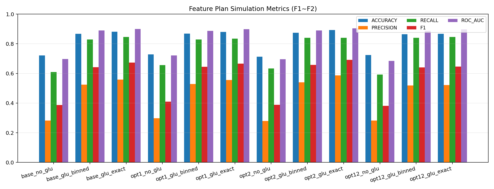
- 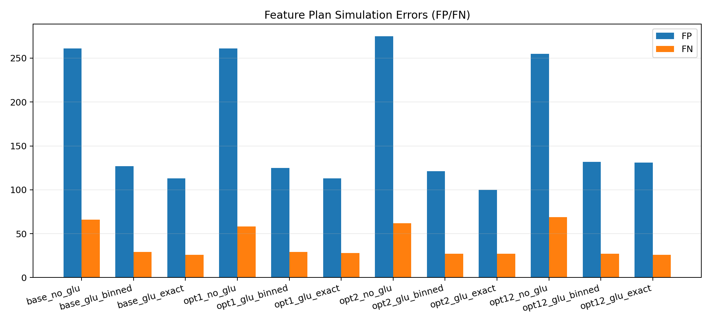

---

## 15. 적용 검토 결과 및 향후 계획

| 항목 | 검토 기준 | 본 보고서 기준 정리 |
|---|---|---|
| 심플 탭 | 입력 부담 최소화 | 현행 유지(변경 없음) |
| 상세 탭 | 성능 개선 + 사용자 수용성 | 조건부 확장 검토(F1, F2 중심) |
| F1 가족력 | no_glu 구간 Recall/FN 개선 확인, glu 입력군 이득 제한 | 조건부 후보(혈당 미입력 경로 우선) |
| F2 고혈압/혈압약 | binned/exact 구간에서 Accuracy·F1 개선 재현 | 우선 검토 후보(상세 탭 1순위) |
| 허리둘레 입력 | 사용자 입력 가능성 및 모델 안정성 | 필수 입력 유지 |
| 운영 모니터링 | Recall/FN/FP 추적 | 분기별 성능 점검 |

---

## 16. 추가 재현 명령 (시뮬레이션)

```bash
cd fastapi
source .venv/bin/activate

# 운영 시나리오 시뮬레이션 (blend 포함)
python simulate_optional_input_cases.py

# 플랜 피처(F1~F2) 포함/미포함 시뮬레이션
python simulate_feature_plan_cases.py
```

---

## 17. 요약 및 향후 반영 방향

| 항목 | 요약 |
|---|---|
| 제품 구성 | 심플 탭은 유지하고, 상세 탭에서 확장 항목을 단계적으로 검토 |
| 입력 정책 | `HE_wc(허리둘레)`는 필수 입력으로 유지 |
| 확장 우선순위 | F2(고혈압/혈압약) 단독 우선 → F1(가족력)은 조건부 검토 |
| 운영 방향 | 기본 경로를 유지하면서, 확장 경로는 검증 결과에 따라 반영 |

### 17-1. 단계별 반영안(초안)

1. **Phase 1**: 상세 탭 확장 경로에 F2 단독 반영 검토(특히 binned/exact), Recall·FP·FN 추적  
2. **Phase 2**: F1은 혈당 미입력 경로 중심으로 조건부 반영 검토 및 재평가  

### 17-2. 성능 검토 기준

| 구분 | 기준(검토 지표) |
|---|---|
| 성능 개선 판단 | 상세 탭 확장 후 `Recall` 개선 또는 `FN` 감소 확인 |
| 주의 신호 | 혈당 정밀 입력군 성능 저하 반복 또는 오탐(`FP`) 급증 |

---

## 18. API 더미 테스트 케이스(실응답)

서버 정책(F2 우선, F1 조건부, KNHANES 외 자동 제외) 검증을 위해 `/predict`를 실제 호출했다.

- 실행 일시: 2026-02-21
- 실행 환경: `uvicorn app.main:app --host 127.0.0.1 --port 8000`
- 공통: 응답의 `chart_image_base64`는 표에서 생략

### 18-1. 케이스 요약 표

| 케이스 | 목적 | HTTP | prediction / probability | used_model | 정책 확인 포인트 |
|---|---|---:|---|---|---|
| case1_knhanes_no_glu_f1f2 | 혈당 미입력 + F1/F2 동시 입력 | 200 | 1 / 1.0 | KNHANES 혈당 미포함 | `input`에 `family_history_dm`, `htn_or_med` 모두 포함 |
| case2_knhanes_glu_f1f2 | 혈당 입력 + F1/F2 동시 입력 | 200 | 1 / 0.55 | KNHANES 블렌드 | `input`에서 `family_history_dm` 제외, `htn_or_med` 유지 |
| case3_knhanes_glu_f2_only | 혈당 입력 + F2만 입력 | 200 | 1 / 0.1607 | KNHANES 블렌드 | `input`에 `htn_or_med`만 포함 |
| case4_pima_with_f1f2 | Pima 경로 + F1/F2 입력 | 200 | 0 / 0.4062 | AdaBoost (혈당 포함) | `input`에서 F1/F2 자동 제외 |
| case5_range_error | 범위 오류(혈당 300) | 400 | - | - | 범위 검증 에러 메시지 확인 |
| case6_minimal_no_glu | 최소 입력(혈당 미입력) | 200 | 1 / 1.0 | KNHANES 혈당 미포함 | 기본 경로 정상 응답 확인 |

### 18-2. 실응답 핵심(JSON 발췌)

#### case2_knhanes_glu_f1f2 (혈당 입력 + F1/F2 동시 입력)

```json
{
  "prediction": 1,
  "probability": 0.55,
  "used_model": "KNHANES 블렌드 (위험인자 55% + 혈당 45%)",
  "input": {
    "glucose": 95.0,
    "bmi": 28.0,
    "age": 47.0,
    "waist_cm": 94.0,
    "sex": 1.0,
    "height_cm": 170.0,
    "htn_or_med": 0.0
  }
}
```

검증: 요청에는 `가족력`을 포함했지만 응답 `input`에서 제외되어 서버 정책이 적용됨.

#### case4_pima_with_f1f2 (Pima 경로 + F1/F2 입력)

```json
{
  "prediction": 0,
  "probability": 0.4062,
  "used_model": "AdaBoost (혈당 포함)",
  "input": {
    "pregnancies": 2.0,
    "glucose": 95.0,
    "bmi": 28.0,
    "age": 47.0
  }
}
```

검증: Pima 경로에서는 `family_history_dm`, `htn_or_med`가 자동 제외됨.

#### case5_range_error (혈당 범위 오류)

```json
{
  "detail": "혈당(glucose) 값은 44.0 ~ 199.0 범위여야 합니다."
}
```

검증: 입력값 범위 검증이 정상 동작함.

